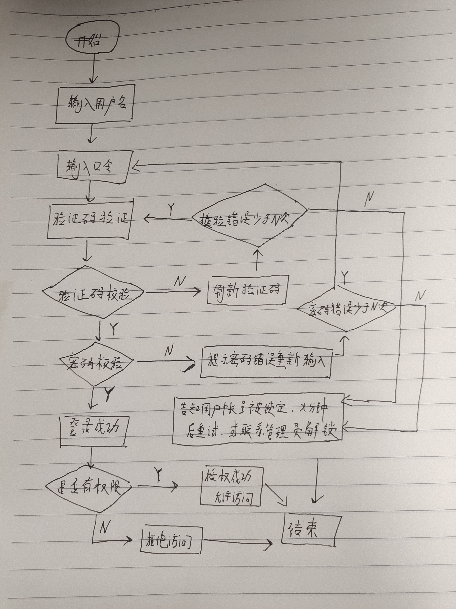
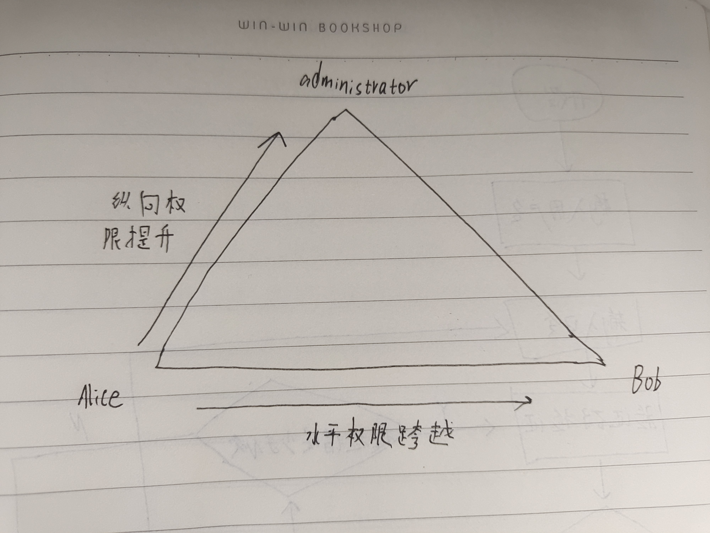
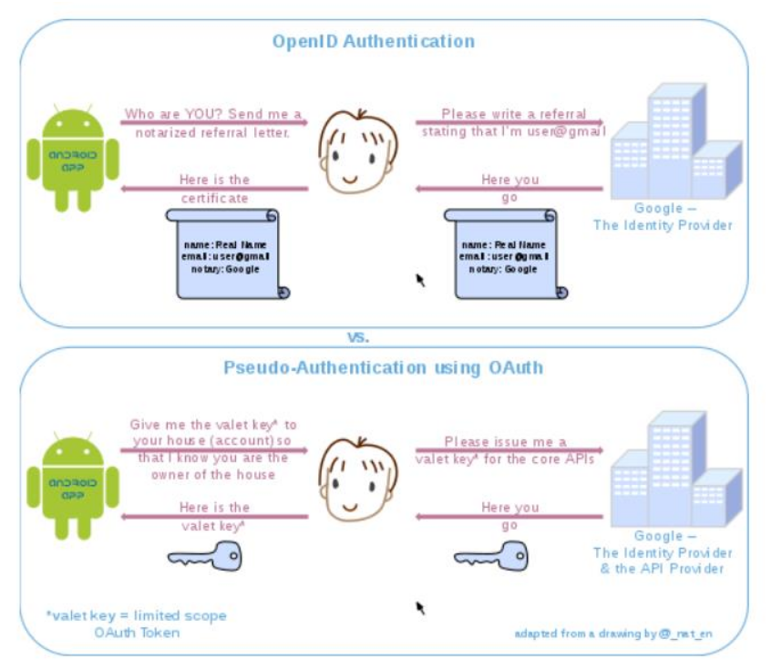

# 第二次实验：操作系统的访问控制设计实例研究

## 实验环境

- 操作系统版本
  - HarmonyOS 2.0.0.165(C00E16R1P4patch03) GPU Turbo
- 硬件设备型号
  - VOG-AL10
- 是否默认设置
  - 是

## 实验过程

- 以 HarmonyOS 为研究对象

  - 当系统处于锁屏状态下接收到新短信时，不解锁情况下

    - 系统是否允许查看短信内容？  **不允许**
    - 系统是否允许回复短信？ **不允许**
    - 安卓上的 App : 以 ***微信电话本*** 为例，在接管了系统短信功能和权限之后，是否会有一些不同的功能设定？ **无该功能**

  - 当系统处于锁屏状态下，使用系统内置（例如 iOS 的 Siri ）或第三方的语音助手可以完成以下哪些操作？

    - 访问通讯录 **不允许**
    - 拨打电话 **允许**
    - 访问相册 **不允许**
    - 查看短信收件箱 **不允许**

  - 如果你的手机支持指纹识别解锁手机，请实验并分析指纹识别相比较于简单密码、复杂密码、图形解锁、人脸识别解锁、声纹解锁等解锁方式的安全性、便利性差异。

  - |        | 简单密码                                   | 复杂密码                             | 图形解锁                               | 人脸识别解锁                                                 | 声纹解锁                                                     |
    | ------ | ------------------------------------------ | ------------------------------------ | -------------------------------------- | ------------------------------------------------------------ | ------------------------------------------------------------ |
    | 安全性 | 指纹识别安全性更高，简单密码容易被暴力破解 | 复杂密码相对简单密码安全性更高       | 指纹识别安全性更高，图形易被偷窥并破解 | 与指纹识别安全性相当，人脸识别受光线、角度等外部因素影响，有时通过照片也可以进行解锁。 | 与指纹识别安全性相当，声纹识别同样受很多外部因素干扰，有时通过录音也可以进行解锁 |
    | 便利性 | 指纹识别更便利，简单密码需要手动输入       | 指纹识别更便利，复杂密码需要手动输入 | 指纹识别更便利，图形解锁需要手动划动   | 指纹识别更便利，人脸识别在一些场合下比较突兀且不便（譬如戴口罩时） | 指纹识别更便利，声纹解锁在一些需要保持安静的场合下显得不太方便 |

思考题：

- 以上设计实现方式属于我们课堂上讲过的哪种强制访问控制模型？Lattice/BLP？Biba？
  - **属于BLP模型；BLP模型侧重于数据的保密性和对机密信息的受控访问，在BLP模型中，用户只能在自己的安全级别或更高的安全级别上创建内容，只能查看在自己的安全级别或更低的安全级别的内容，即“下读上写”**
- 系统或第三方应用程序是否提供了上述功能的访问控制规则修改？如果修改默认配置，是提高了安全性还是降低了安全性？
  - **是；但修改默认配置对安全性的影响是基于具体的修改规则的，要视情况而定。**

## 课后题

### 1.生物特征身份认证方式有哪些？优缺点分析？应用场景举例。

- 指纹识别：
  - 应用场景：指纹识别技术是目前较为成熟且价格便宜的生物特征识别技术。目前来说指纹识别的技术应用非常广泛，在门禁、考勤系统中可以看到指纹识别技术的身影，市场上有了更多指纹识别的应用：如笔记本电脑、手机、汽车、银行支付都可应用指纹识别的技术。
  
  - 优点：指纹是人体独一无二的特征，每个人的指纹都是唯一的，所以能够用来进行身份认证；每个人的指纹都是相当固定的，很难发生变化；易于获取指纹样本、易于开发识别系统、实用性强；扫描指纹的速度很快，使用非常方便。
  
  - 缺点：容易留下痕迹并被非法提取；容易被伪造；特殊群体指纹信息少，识别困难；手指极干燥或极潮湿的情况下识别较为困难。

- 人脸识别：
  - 应用场景：脸识别技术的应用已经不仅限在商务场所中，它已经以各种智能家居的形式逐步渗透到平常百姓家。 
  
  - 优点：非接触性：相比较其他生物识别技术而言，人脸识别是非接触的，用户不需要和设备直接接触；并发性：在实际应用场景中，人脸识别技术可以进行多个人脸的分拣、判断及识别；非强制性：被识别的人脸图像信息可以主动获取而不被被测个体察觉；自然性：所谓的自然性是指通过观察比较人脸来区分和确认身份;具有自然性的识别还有语音识别和体形识别。
  
  - 缺点：人类脸部存在相似性，不同个体之间的区别不大，所有的人脸的结构都相似，甚至人脸器官的结构外形都很相似，在加上化妆的掩盖及双胞胎的天然相似性更增加了识别的难度；人脸存在易变性，人脸的外形很不稳定，人可以通过脸部的变化产生很多表情；而在不同观察角度，人脸的视觉图像也相差很大。

- 声纹识别：
  - 应用场景：在军事情报方面，用于电话领域的监听与追踪；在监狱管理中，用于亲情通话对象的管控；在司法取证方面，语音声纹分析识别用于司法鉴定；在基于电话网络身份识别的应用方面，比如：手机网络支付，手机网络银行等金融业务，社保身份认证，电子政务平台身份认证，呼叫中心来电人员语音辨认，在忘却密码时，自己通过电话将个人帐户密码自助重设，还有电话语音声纹考勤等。
 
  - 优点：非常适合远程身份确认，只需要一个麦克风或电话、手机就可以通过网路实现远程登录；蕴含声纹特征的语音获取方便、自然；获取语音的成本低廉，使用简单，像麦克风、通讯设备等皆可；声纹辨认和确认的算法复杂度低；配合一些其他措施，如通过语音识别进行内容鉴别等，可以提高准确率。
  
  - 缺点：同一个人的声音具有易变性，易受身体状况、年龄、情绪等的影响；不同的麦克风和信道对识别性能有影响；环境噪音对识别有干扰；混合说话人的情形下人的声纹特征不易提取；当人感冒，咽喉发炎等情况声带特性会发生变化而导致识别障碍。

- 虹膜识别：
  - 应用场景：安防设备（如门禁等），以及有高度保密需求的场所。

  - 优点：相对于其他生物识别技术而言，虹膜识别误识率和拒真率已经达到了零几率的识别水平；虹膜识别属于非接触式的识别，识别方便高效；虹膜是每个人特有的，具有不可复制的特性，安全等级来说是目前较高的。

  - 缺点：虹膜识别的应用价格也因其技术难度成正比，设备造价高，无法大范围推广；很难将图像获取设备的尺寸小型化；镜头可能产生图像畸变而使可靠性降低。

- 静脉识别
  - 应用场景：银行存取钱；公司考勤记录；考场学生身份的证明。

  - 优点：属于内生理特征，不会磨损，较难伪造，具有很高安全性；血管特征通常更明显，容易辨识，抗干扰性好；可实现非接触式测量，卫生性好，易于为用户接受；不易受手表面伤痕或油污的影响。

  - 缺点：手背静脉仍可能随着年龄和生理的变化而发生变化，永久性尚未得到证实；虽然可能性较小，但仍然存在无法成功注册登记的可能；由于采集方式受自身特点的限制，产品难以小型化；采集设备有特殊要求，设计相对复杂，制造成本高。

### 2.“找回口令功能”和“忘记密码”在访问授权机制中的意义？请尝试设计几种安全的“找回口令功能”，详细描述找回口令的用户具体操作过程。

- 意义：使得被授权用户在忘记口令、密码时有途径能重新获取授权

- 安全的“找回口令功能”：
  - 重置密码时用手机短信码来确认身份，然后才允许发送重置链接到用户邮箱；
  - 从邮箱点击重置链接后，允许更改密码，但需要回答一个随机的（注册时设置的）安全问题；
  - 用户主动发送验证码至特定邮箱/号码，完成身份认证后再进行下一步重置操作。

### 3.绘制用户使用用户名/口令+图片验证码方式录系统的流程图。考虑认证成功和失败两种场景，考虑授权成功和失败两种场景。

### 4. Windows XP / 7 中的访问控制策略有哪些？访问控制机制有哪些？

- 访问控制策略
  - 强制访问控制
  - 基于角色的访问控制
- 访问控制机制
  - 安全描述符（所有者安全标识、组安全标识、自主访问控制表、系统访问控制表）
  - 访问令牌

### 5.用权限三角形模型来理解并描述下 2 种威胁模型：提权、仿冒。

**权限三角形模型：用户 → 角色（分级） → 权限（对象+操作）**

**提权：**

- 提权分为：水平特权提升、垂直特权提升

- 提权是指本来没有某项权限的用户，通过一定的方法获得该权限，简而言之，用户以自己的身份获得了本不属于自己的权限

  - 比如用户A本来只能对一个文件进行查看，但是通过提权获得了对文件修改的权利（垂直提权）

  - 或者用户A本来只能查看自己的文件，通过提权可以查看B的文件（水平提权）
  
- 提权是**用户→角色→权限**，角色不变，而获取的权限扩大

**仿冒**

- 仿冒是，用户A以用户B的身份通过了认证，之后行使了B所有的权利

- 仿冒是用户→角色，获取的角色改变，所以能够行使的权限也就因角色的改变而改变了

### 6. 试通过操作系统的访问控制机制来达到预防一种真实病毒的运行目的。

后门木马能让恶意用户远程控制受感染的计算机。它们能使其作者在受感染的计算机上随心所欲地进行任何活动，包括发送、接收、启动和删除文件；显示数据以及重启计算机。后门木马通常用于联合一组受害者计算机，以形成一个可被用于犯罪目的的僵尸网络。

- 利用自动播放功能
- 添加注册表自启动
- 定时关闭特定程序，如杀毒软件、防火墙
- 删除文件等

通过访问控制机制拦截或终止远程恶意用户对文件或系统服务的操作，即可达到预防该病毒的目的。

### 7.什么是 OAuth？

开放授权(OAuth)是一个开放标准/授权协议，而不是身份验证协议。允许用户在第三方应用上访问该用户在某一网站上存储的资源，而无需把用户名和密码提供给第三方应用。与以往的授权方式不同之处是OAuth的授权不会使第三方触及到用户的帐号信息（如用户名与密码），即第三方无需使用用户的用户名与密码就可以申请获得该用户资源的授权。同时，任何第三方都可以使用OAuth认证服务，任何服务提供商都可以实现自身的OAuth认证服务。

### 8. 什么是 OpenID？

OpenID 是一个以用户为中心的数字身份识别框架，是一个以URL为身份标识的分散式身份验证解决方案，它具有开放、分散、自由等特性。

OpenID的创建基于这样一个概念：可以通过URL来认证一个网站的唯一身份，同理，也可以让每人通过一个URL(一个OpenID身份就是一个URL)，在多个网站上进行登录，作为用户的身份认证。

形象一点来说：URL是护照，OpenID服务器就是户口所在地。首先在一个OpenID服务器网站注册，获得一个URL，等于申请一个了“出入许可证”。然后可以直接使用这个URL来登录别的网站，也可以把这个URL加到自己的主页，让个人主页的URL具备OpenID URL的功能，就像是一个复印件。然后就可以拿这个URL到支持OpenID的网站去登录了。不需要每个网站都注册一遍，因为你的信息已经保存在OpenID服务器上，并获得那些网站的认可。好比是银行卡可以在银联内的多家银行取钱一样。不用担心自己的用户名被别人抢注，也不用怕忘记那许多用户名和密码。

### 9. 试用本章所学理论分析 OAuth 和 OpenID 的区别与联系。

OAuth关注的是授权，即：“用户能做什么”，允许你以同一个账户在多个网站登陆。它仅仅是为你的合法身份背书，当你以 Facebook 账号登陆某个站点之后，该站点无权访问你的在 Facebook 上的数据。

OpenID关注的是证明，即：“用户是谁”，允许被授权方访问授权方的用户数据。

这两者是互补的。

### 10. 如何使用 OAuth 和 OpenID 相关技术实现单点登录（Single Sign On）？

- OAuth

  - 用户首先要保持登录，即已认证通过的状态
  - 第三方应用请求用户授权
  - 用户授权成功之后会向Authorization Server（认证服务器）请求“授权码”（指authorization_code而不是最终的access_token），请求中还会携带redirect_uri（跳转至第三方应用的链接）
  - 获得“授权码”之后用户所在的浏览器网页将跳转到redirect_uri（即第三方应用）
  - 第三方应用携带“授权码”和应用认证信息（client_id & client_secret）到Authorization Server换取access_token
  - 第三方应用就可以在访问开放平台时带上access_token 

- OpenID

  - 当用户第一次登录时，将用户名密码发送给验证服务；
  - 验证服务将用户标识OpenId返回到客户端；
  - 客户端进行存储；
  - 访问子系统时，将OpenId发送到子系统；
  - 子系统将OpenId转发到验证服务；
  - 验证服务将用户认证信息返回给子系统；
  - 子系统构建用户验证信息后将授权后的内容返回给客户端。

### 参考文献

- [常见的生物特征识别方式](https://jingyan.baidu.com/article/ae97a646f546e9bbfd461df2.html)

- [什么是 OAuth？](https://www.cnblogs.com/programb/p/13019474.html)

- [什么是OpenID？OpenID概念、原理和案例介绍](https://www.cnblogs.com/iskyoole/articles/2659273.html)

- [OpenID及其原理介绍,OAuth和OpenID的区别](https://blog.csdn.net/xcjing/article/details/73826889)

- [OAuth认证实现机制及单点登录原理](https://segmentfault.com/a/1190000005357718)

- [单点登录三个方法及原理](https://blog.csdn.net/han2529386161/article/details/52267366)