# 网络安全第五章实验： 基于Scapy编写端口扫描器

## 实验目的
- 掌握网络扫描之端口状态探测的基本原理

## 实验环境
- python + scapy 2.4.3
- nmap

## 网络拓扑结构

 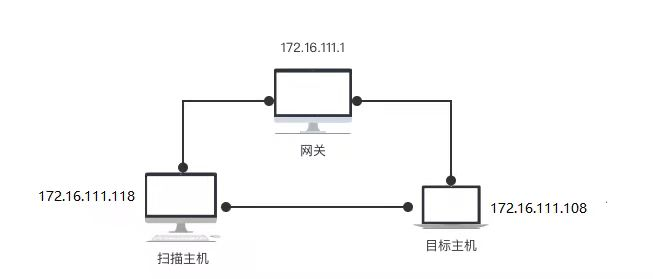

- 网关：Debian-getaway：172.16.111.1
- 攻击者主机：kali-attacker:172.12.111.105
- 目标靶机：kali-victim:172.16.111.112

## 实验要求
- [ √ ] TCP connect scan / TCP stealth scan
- [ √ ] TCP Xmas scan / TCP fin scan / TCP null scan
- [ √ ] UDP scan
- 上述每种扫描技术的实现测试均需要测试端口状态为：开放、关闭和过滤状态时的程序执行结果
- 提供每一次扫描测试的抓包结果并分析与课本中的扫描方法原理是否相符？如果不同，试分析原因
- 在实验报告中详细说明实验网络环境拓扑、被测试 IP 的端口状态是如何模拟的
- （可选）复刻nmap的上述扫描技术实现的命令行参数开关

## 实验过程
- 端口状态模拟
  ```
  1. 关闭状态
  sudo ufw disable
  systemctl stop apache2
  systemctl stop dnsmasq 关闭端口
  2. 开放状态
  systemctl start apache2 开启服务开放TCP端口
  systemctl start dnsmasq 开启服务开放UDP端口
  3. 被过滤状态
  sudo ufw enable && sudo ufw deny 80/tcp
  sudo ufw enable && sudo ufw deny 53/udp
  ```

- 环境准备
  - 在kali-victim中安装ufw，用于控制端口打开、关闭以及过滤：sudo apt install ufw
  - 在kali-victim中安装dnsmasq，用于搭建dns服务：sudo apt install dnsmasq
  - 在kali-victim中运行sudo service ssh start/stop控制22/tcp端口开关 sudo service dnsmasq start/stop控制53/udp端口开关

  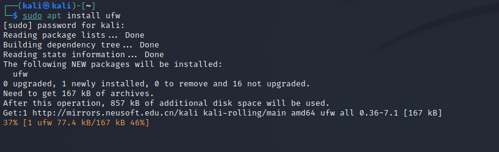

  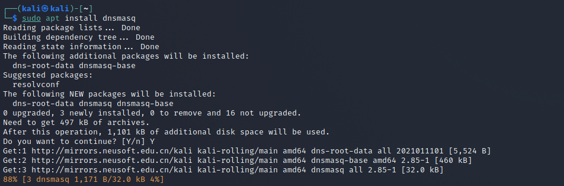

## TCP connect scan
- 在攻击者主机编写文件 TCPconnect.py
  ```
  from scapy.all import *
  def tcpconnect(dst_ip,dst_port,timeout=10):
      pkts=sr1(IP(dst=dst_ip)/TCP(dport=dst_port,flags="S"),timeout=timeout)
      if (pkts is None):
          print("FILTER")
      elif(pkts.haslayer(TCP)):
          if(pkts[1].flags=='AS'):
              print("OPEN")
          elif(pkts[1].flags=='AR'):
              print("CLOSE")
  tcpconnect('172.16.111.112',80)
  ```
  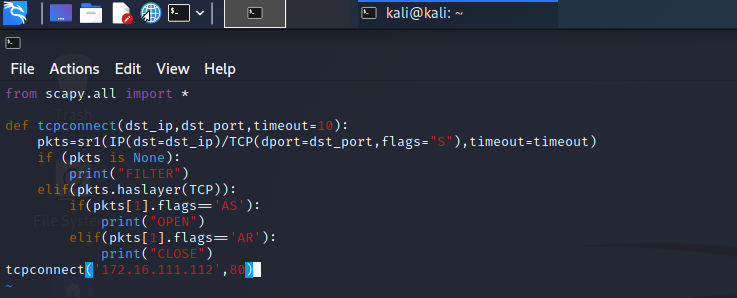

- Closed

  靶机检测自身端口状态

  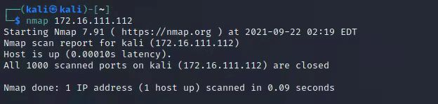

  攻击者主机运行 TCPconnect.py 脚本

  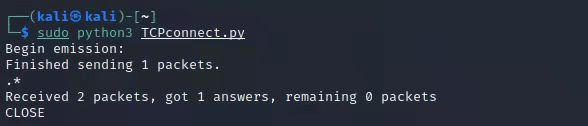

  靶机Wireshark抓包

  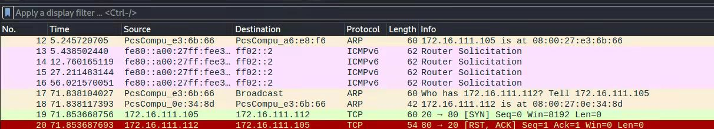

  攻击者主机nmap复刻
  
  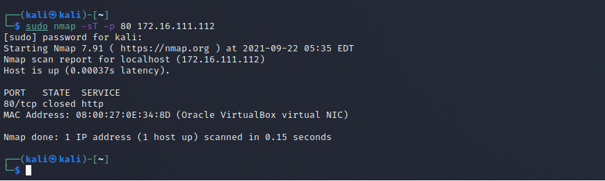

  分析：TCP三次握手机制，攻击者主机向靶机发送连接请求后，靶机相应端口处于关闭状态，靶机将会向攻击者返回[RST,ACK]包，抓包结果与预期结果一致。  
  
- Open

  攻击者主机运行 TCPconnect.py 脚本
  
  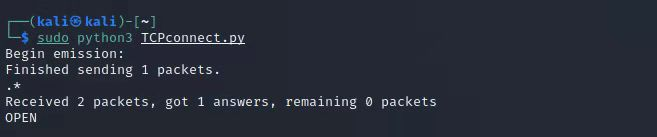

  靶机Wireshark抓包

  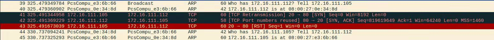

  攻击者主机nmap复刻

  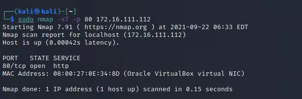

  分析：TCP三次握手机制，攻击者主机向靶机发送连接请求后，收到靶机返回[SYN/ACK]数据包，抓包结果与预期结果一致。

- Filtered

  攻击者主机运行 TCPconnect.py 脚本

  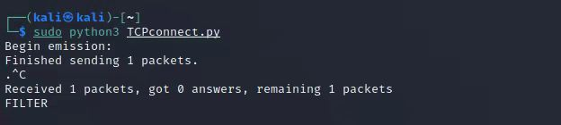

  靶机Wireshark抓包

  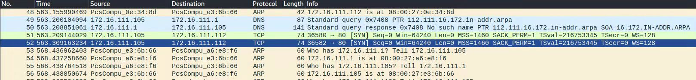

  攻击者主机nmap复刻

  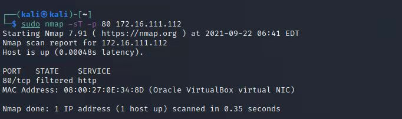

  分析：TCP三次握手机制，攻击者主机向靶机发送连接请求后，没有得到任何响应，抓包结果与预期结果一致。

## TCP stealth scan
- 在攻击者主机编写文件 TCPstealth.py
  ```
  from scapy.all import *
  def tcpstealthscan(dst_ip , dst_port , timeout = 10):
      pkts = sr1(IP(dst=dst_ip)/TCP(dport=dst_port,flags="S"),timeout=10)
      if (pkts is None):
          print ("Filtered")
      elif(pkts.haslayer(TCP)):
          if(pkts.getlayer(TCP).flags == 0x12):
              send_rst = sr(IP(dst=dst_ip)/TCP(dport=dst_port,flags="R"),timeout=10)
              print ("Open")
          elif (pkts.getlayer(TCP).flags == 0x14):
              print ("Closed")
          elif(pkts.haslayer(ICMP)):
              if(int(pkts.getlayer(ICMP).type)==3 and int(stealth_scan_resp.getlayer(ICMP).code) in [1,2,3,9,10,13]):
                  print ("Filtered")
  tcpstealthscan('172.16.111.112',80)
  ```
  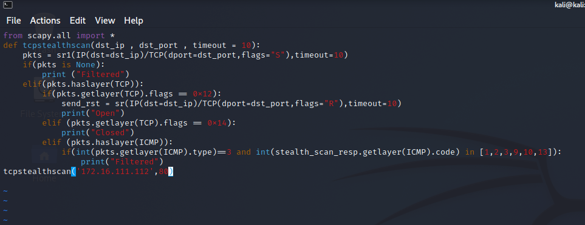


- Closed
  
  攻击者主机运行 TCPstealth.py 脚本
  
  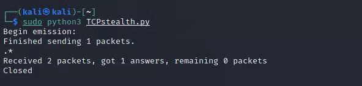

  靶机Wireshark抓包

  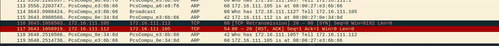

  攻击者主机nmap复刻

  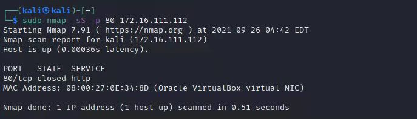

- Open

  攻击者主机运行 TCPstealth.py 脚本

  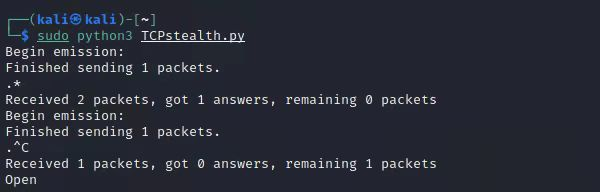

  靶机Wireshark抓包

  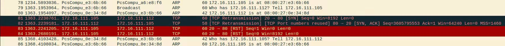

  攻击者主机nmap复刻

  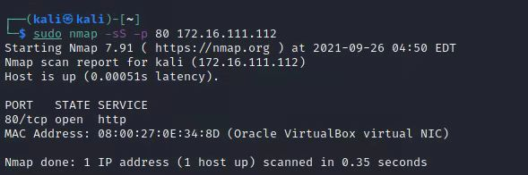

- Filtered

  攻击者主机运行 TCPstealth.py 脚本

  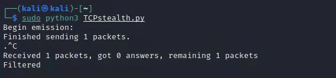

  靶机Wireshark抓包

  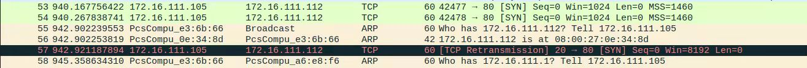

  攻击者主机nmap复刻

  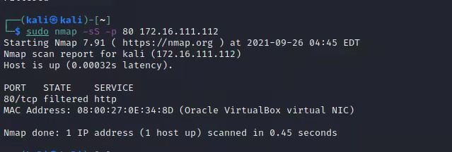
  
## TCP Xmas scan
- 在攻击者主机编写文件 TCPxmas.py
  ```
  from scapy.all import *
  def Xmasscan(dst_ip , dst_port , timeout = 10):
      pkts = sr1(IP(dst=dst_ip)/TCP(dport=dst_port,flags="FPU"),timeout=10)
      if (pkts is None):
          print ("Open|Filtered")
      elif(pkts.haslayer(TCP)):
           if(pkts.getlayer(TCP).flags == 0x14):
              print ("Closed")
      elif(pkts.haslayer(ICMP)):
           if(int(pkts.getlayer(ICMP).type)==3 and int(pkts.getlayer(ICMP).code) in [1,2,3,9,10,13]):
              print ("Filtered")
  Xmasscan('172.16.111.108',80)
  ```
  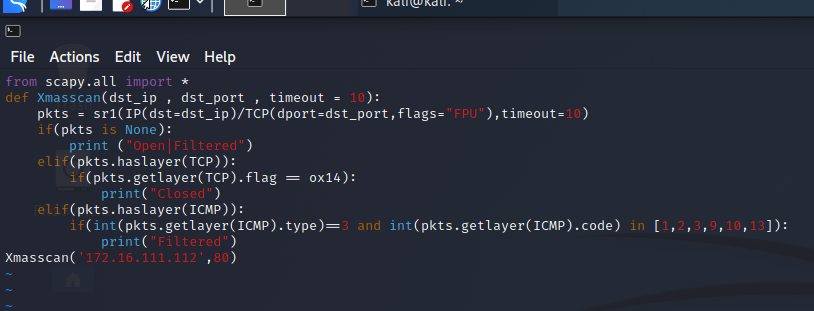

- Closed

  攻击者主机运行 TCPxmas.py 脚本
  
  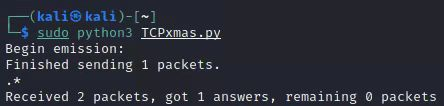

  靶机Wireshark抓包

  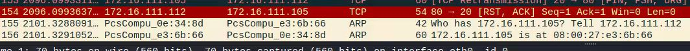

  攻击者主机nmap复刻

  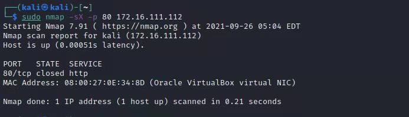

  分析：Xmas发送TCP请求，在靶机端口关闭状态下，靶机响应[RST，ACK]，抓包结果与预期结果一致。

- Open

  攻击者主机运行 TCPxmas.py 脚本

  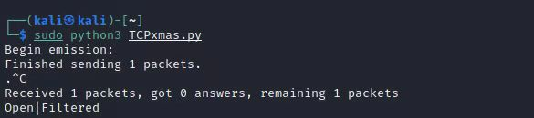

  靶机Wireshark抓包

  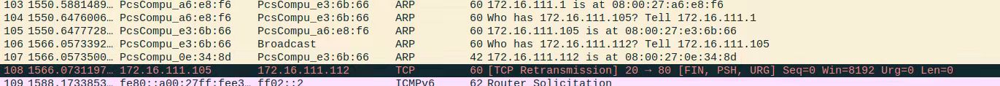

  攻击者主机nmap复刻

  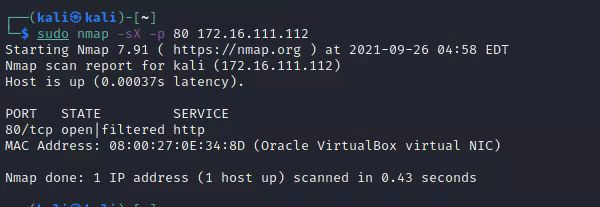

  分析：Xmas发送TCP请求，在靶机端口开放状态下，靶机无响应，抓包结果与预期结果一致。

- Filtered

  攻击者主机运行 TCPxmas.py 脚本

  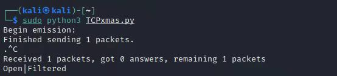

  靶机Wireshark抓包

  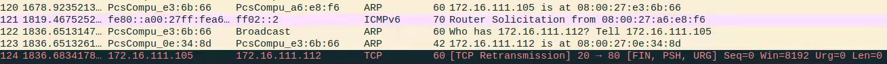

  攻击者主机nmap复刻

  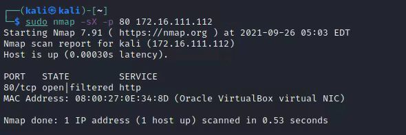

  分析：Xmas发送TCP请求，在靶机端口被过滤状态下，靶机无响应，抓包结果与预期结果一致。

- TCP fin scan
- 在攻击者主机编写文件 TCPfin.py
  ```
  from scapy.all import *
  def finscan(dst_ip , dst_port , timeout = 10):
      pkts = sr1(IP(dst=dst_ip)/TCP(dport=dst_port,flags="F"),timeout=10)#发送FIN包
      if (pkts is None):
          print ("Open|Filtered")
      elif(pkts.haslayer(TCP)):
           if(pkts.getlayer(TCP).flags == 0x14):
              print ("Closed")
      elif(pkts.haslayer(ICMP)):
           if(int(pkts.getlayer(ICMP).type)==3 and int(pkts.getlayer(ICMP).code) in [1,2,3,9,10,13]):
              print ("Filtered")
  finscan('172.16.111.112',80)
  ```
 
  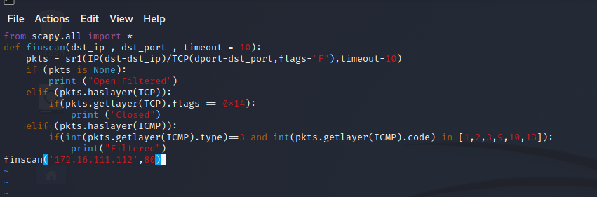

- Closed

  攻击者主机运行 TCPfin.py 脚本
  
  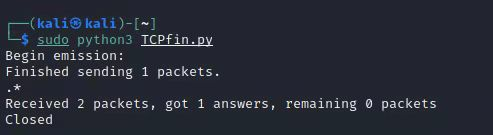

  靶机Wireshark抓包

  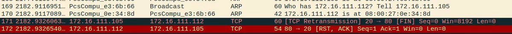

  攻击者主机nmap复刻

  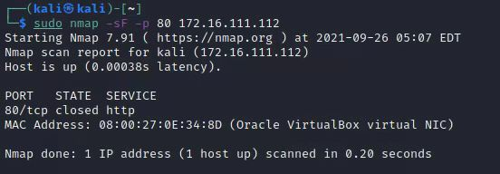

- Open

  攻击者主机运行 TCPfin.py 脚本

  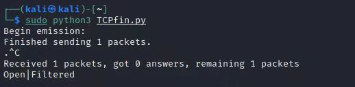

  靶机Wireshark抓包

  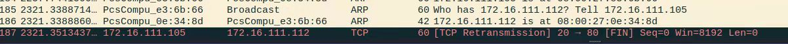

  攻击者主机nmap复刻

  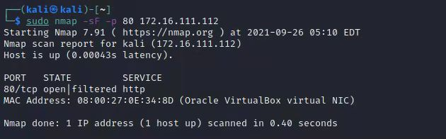

- Filtered

  攻击者主机运行 TCPfin.py 脚本

  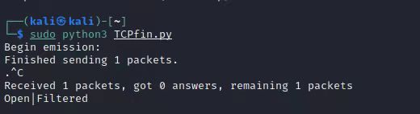

  靶机Wireshark抓包

  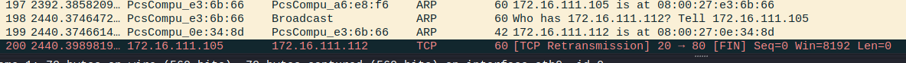

  攻击者主机nmap复刻

  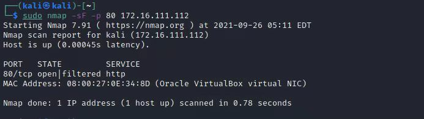  

## TCP null scan
- 在攻击者主机编写文件 TCPnull.py
  ```
  from scapy.all import *
  def nullscan(dst_ip , dst_port , timeout = 10):
      pkts = sr1(IP(dst=dst_ip)/TCP(dport=dst_port,flags=""),timeout=10)
      if (pkts is None):
          print ("Open|Filtered")
      elif(pkts.haslayer(TCP)):
           if(pkts.getlayer(TCP).flags == 0x14):
              print ("Closed")
      elif(pkts.haslayer(ICMP)):
           if(int(pkts.getlayer(ICMP).type)==3 and int(pkts.getlayer(ICMP).code) in [1,2,3,9,10,13]):
              print ("Filtered")
  nullscan('172.16.111.112',80)
  ```
 
  

- Closed

  攻击者主机运行 TCPnull.py 脚本
  
  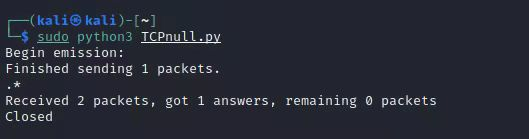

  靶机Wireshark抓包

  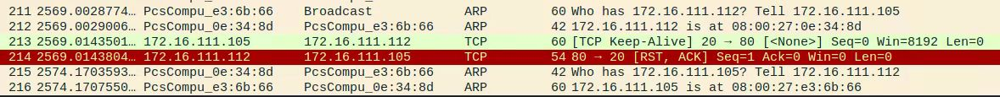

  攻击者主机nmap复刻

  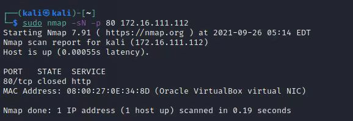

- Open

  攻击者主机运行 TCPnull.py 脚本

  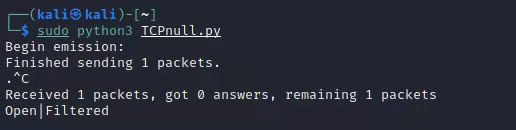

  靶机Wireshark抓包

  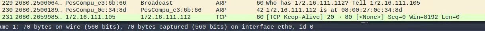

  攻击者主机nmap复刻

  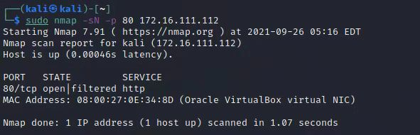

- Filtered

  攻击者主机运行 TCPnull.py 脚本

  

  靶机Wireshark抓包

  

  攻击者主机nmap复刻

   

## UDP scan
- 在攻击者主机编写文件 UDPscan.py
  ```
  from scapy.all import *
  def udpscan(dst_ip,dst_port,dst_timeout = 10):
      resp = sr1(IP(dst=dst_ip)/UDP(dport=dst_port),timeout=dst_timeout)
      if (resp is None):
          print("Open|Filtered")
      elif (resp.haslayer(UDP)):
          print("Open")
      elif(resp.haslayer(ICMP)):
           if(int(resp.getlayer(ICMP).type)==3 and int(resp.getlayer(ICMP).code)==3):
              print("Closed")
           elif(int(resp.getlayer(ICMP).type)==3 and int(resp.getlayer(ICMP).code) in [1,2,9,10,13]):
              print("Filtered")
           elif(resp.haslayer(IP) and resp.getlayer(IP).proto==IP_PROTOS.udp):
              print("Open")
  udpscan('172.16.111.112',53)
  ```

   

- Closed

  攻击者主机运行 UDPscan.py 脚本
  
  

  靶机Wireshark抓包

  

  攻击者主机nmap复刻

  

  分析：UDP扫描属于开放式扫描，靶机udp/53 端口关闭状态下，对攻击者主机并无任何响应，抓包结果与预期结果一致。

- Open

  攻击者主机运行 UDPscan.py 脚本
  
  

  靶机Wireshark抓包

  

  攻击者主机nmap复刻

  

  分析：UDP扫描属于开放式扫描，靶机udp/53 端口开启状态下，对攻击者主机并无任何响应，无法判断被过滤或开启，抓包结果与预期结果一致。
  
- Filtered

  攻击者主机运行 UDPscan.py 脚本
  
  

  靶机Wireshark抓包

  

  攻击者主机nmap复刻

  

  分析：UDP扫描属于开放式扫描，靶机udp/53 端口被过滤状态下，对攻击者主机并无任何响应，无法判断被过滤或开启，抓包结果与预期结果一致。

## 参考资料

- [2020-ns-public-chococolate](https://github.com/CUCCS/2020-ns-public-chococolate/blob/chap0x05/chap0x05/chap0x05.md)

- [ namp用法详解 ](https://blog.csdn.net/independe/article/details/96615598)

- [ UFW防火墙配置命令 ](https://blog.csdn.net/qq_20336817/article/details/45059807) 

- [ iptables防火墙配置命令 ](https://blog.csdn.net/zht666/article/details/17505789)

- [ UFW与iptables ](https://blog.csdn.net/chonghu5376/article/details/100735233)