# 实验九：Snort入侵检测

## 实验目的
- 进行入侵检测的软件实现体验

## 实验要求
- 通过配置snort不同规则来进行网络入侵检测

## 实验环境
- 两台debian主机，可互通
  - Debian-victim-1: 172.16.111.127/24
  - Debian-victim-2: 172.16.111.102/24
  - Debian-gateway: 172.16.111.1/24
  - 工具：snort

## 实验准备
在Debian-victim-1上安装Snort：

- 禁止在apt安装时弹出交互式配置界面
  ```
  export DEBIAN_FRONTEND=noninteractive
  ```
- 安装snort
  ```
  apt install snort
  ```

  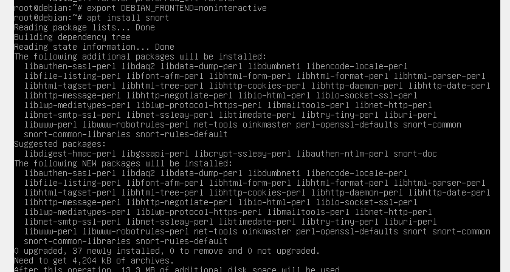

- 由于export DEBIAN_FRONTEND=noninteractive默认设置网卡eth0而系统中所使用的enp0s3，所以我们需要在弹出交互页面进行手动配置。
  
  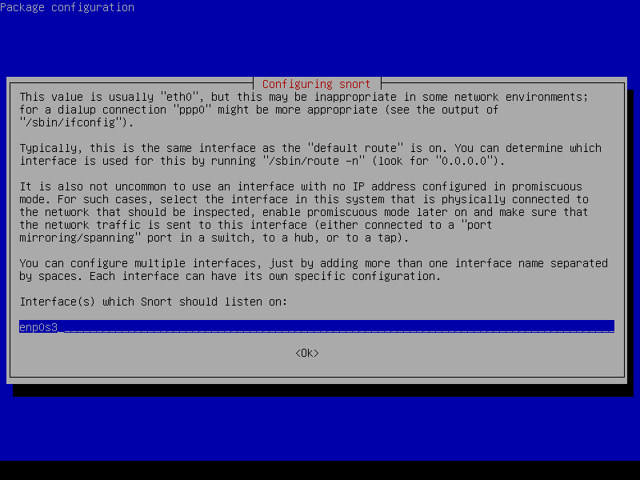

- 开启测试模式测试snort配置
  ```
  snort -T -c /etc/snort/snort.conf
  ```
  
  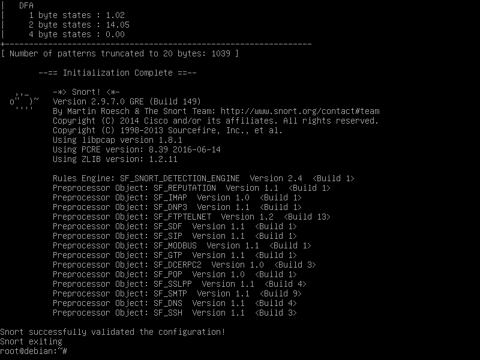

## 实验过程
### 实验一：配置snort为嗅探模式

- 显示IP/TCP/UDP/ICMP头
  ```
  snort –v
  ```

  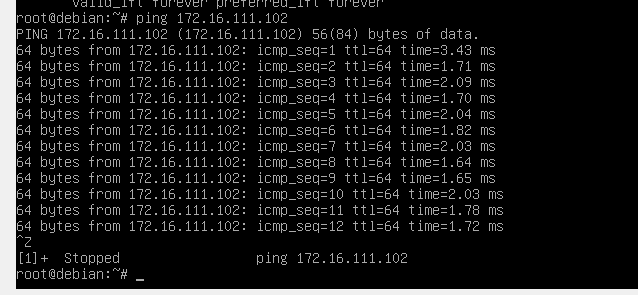  

  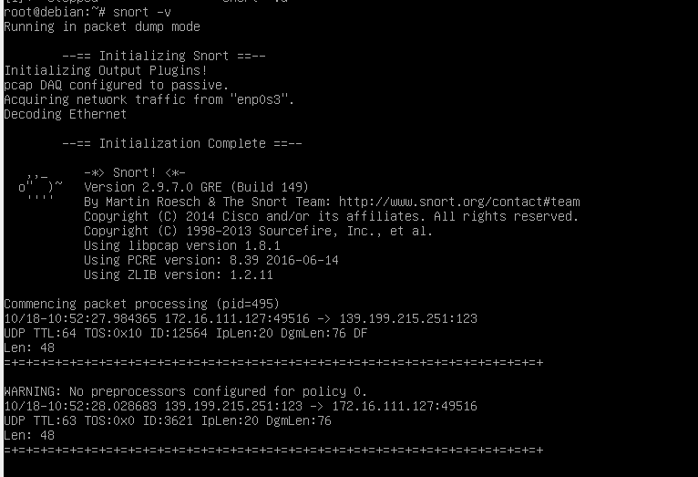 

  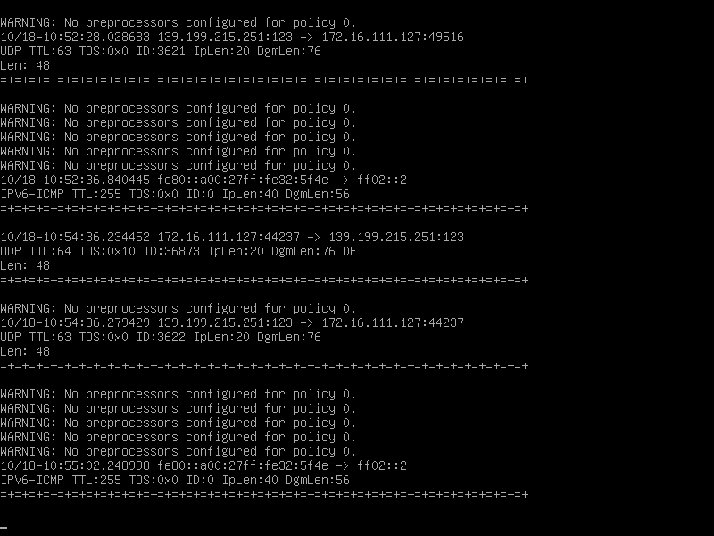 

- 显示应用层数据
  ```
  snort -vd
  ```
  
  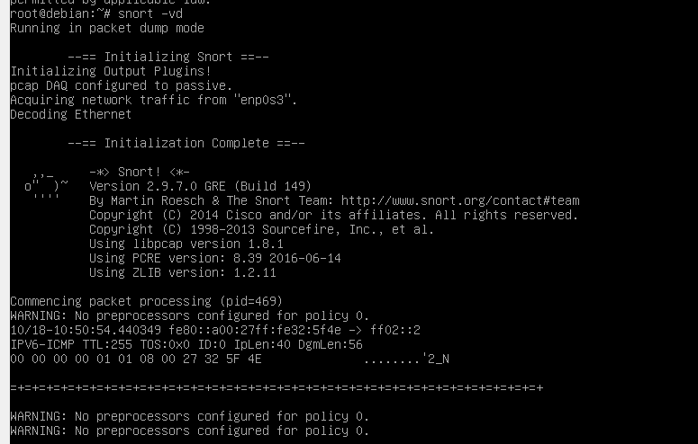

  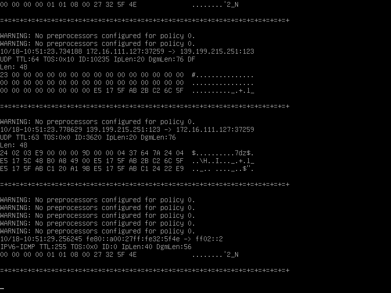

- 显示数据链路层报文头
  ```
  snort -vde
  ```

  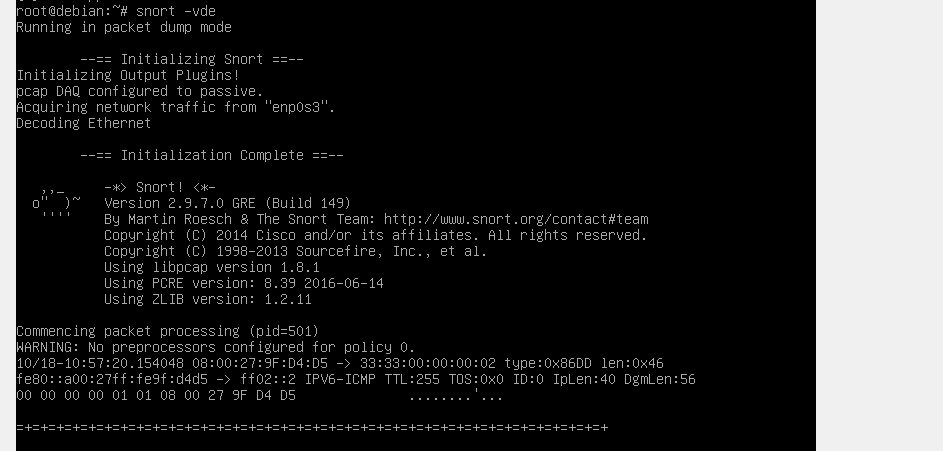

  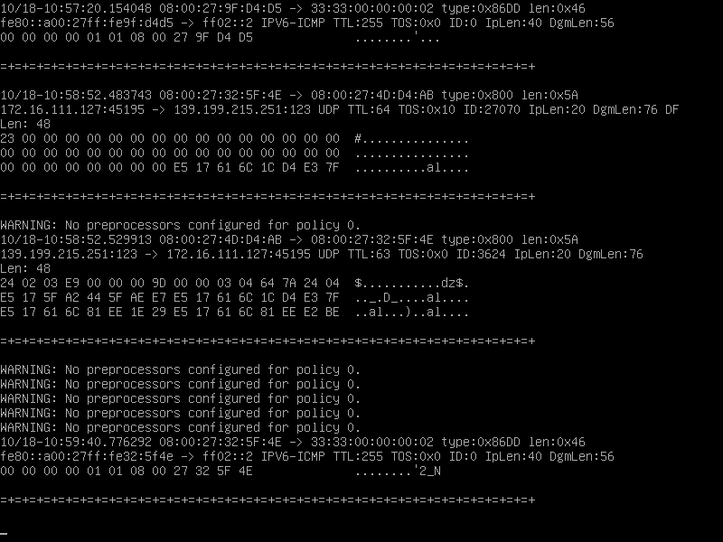

```
# -b 参数表示报文存储格式为 tcpdump 格式文件
# -q 静默操作，不显示版本欢迎信息和初始化信息
snort -q -v -b -i eth1 "port not 22"

# 使用 CTRL-C 退出嗅探模式
# 嗅探到的数据包会保存在 /var/log/snort/snort.log.<epoch timestamp>
# 其中<epoch timestamp>为抓包开始时间的UNIX Epoch Time格式串
# 可以通过命令 date -d @<epoch timestamp> 转换时间为人类可读格式
# exampel: date -d @1511870195 转换时间为人类可读格式
# 上述命令用tshark等价实现如下：
tshark -i enp0s3 -f "port not 22" -w 1_tshark.pcap
```

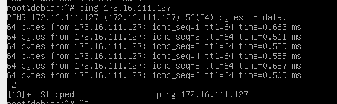

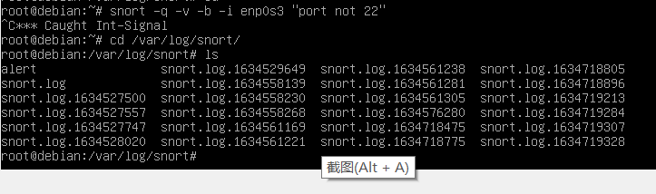


### 实验二：配置并启用snort内置规则

- 正确定义HOME_NET 和 EXTERNAL_NET，处于学习与实验目的将之设为any
  ```
  vim /etc/snort/snort.conf
  ```

  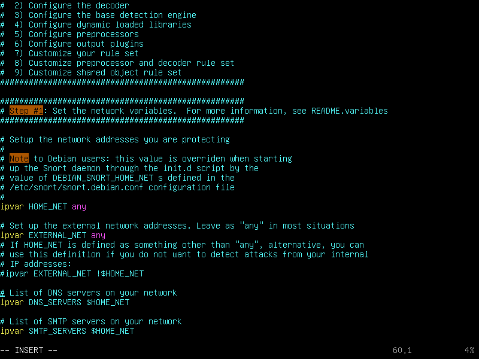

- 启用snort内置规则
  ```
  snort -q -A console -b -i enp0s3 -c /etc/snort/snort.conf -l /var/log/snort/
  ```

  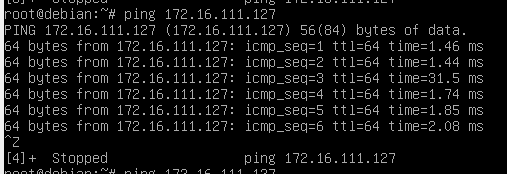

  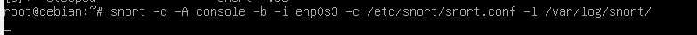

  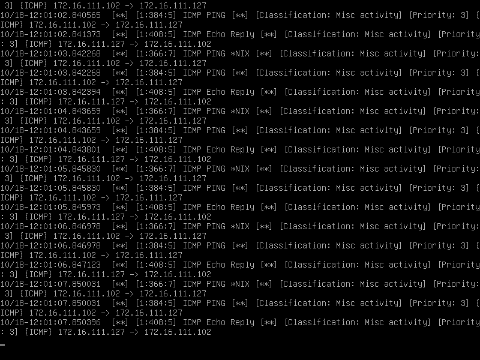

### 实验三：自定义snort规则

- 新建snort规则文件
  ```
  cat << EOF > /etc/snort/rules/cnss.rules

  alert tcp $EXTERNAL_NET any -> $HTTP_SERVERS 80 (msg:"Access Violation has been detected on /etc/passwd ";flags: A+; content:"/etc/passwd"; nocase;sid:1000001; rev:1;)

  alert tcp $EXTERNAL_NET any -> $HTTP_SERVERS 80 (msg:"Possible too many connections toward my http server"; threshold:type threshold, track by_src, count 100, seconds 2; classtype:attempted-dos; sid:1000002; rev:1;)

  EOF
  ```

  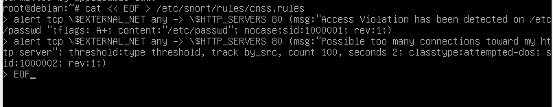

- 添加新的配置到原始配置文件/etc/snort/snort.conf
  ```
  include $RULE_PATH/cnss.rules
  ```

  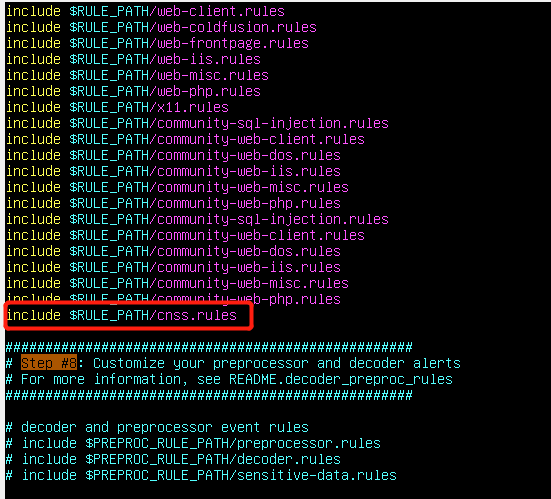

- 启用新的配置
  ```
  snort -q -A fast -b -i enp0s3 -c /etc/snort/snort.conf -l /var/log/snort/
  ```

  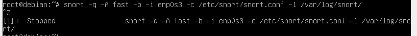

- 发现靶机发出了警报，可见配置生效

  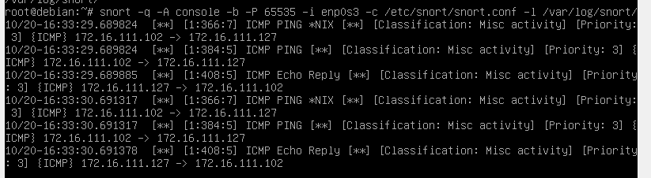

### 实验四：和防火墙联动
- Debain-1下载 Guardian-1.7.tar.gz 并解压
  ```
  wget https://c4pr1c3.github.io/cuc-ns/chap0x09/attach/guardian.tar.gz

  tar zxf guardian.tar.gz -C /home
  ```

- 安装 Guardian 的依赖 lib
  ```
  apt install libperl4-corelibs-perl
  ```

  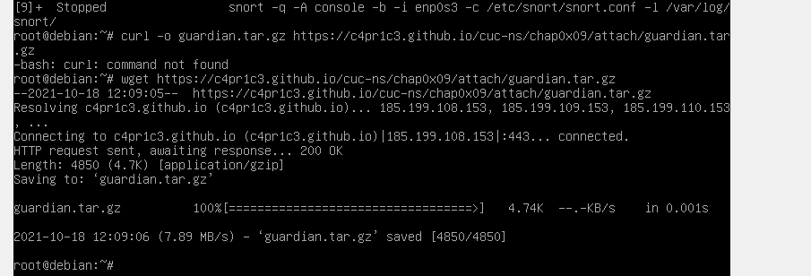

  

- 在靶机上先后开启 snort 和 guardian.pl
  ```
  # 开启 snort
  snort -q -A fast -b -i enp0s3 -c /etc/snort/snort.conf -l /var/log/snort/
  ```

  

- 切换至guardian的目录/home/guardian,编辑 guardian.conf 并保存，确认以下2个参数的配置符合主机的实际环境参数。
  ```
  HostIpAddr 172.16.111.127

  Interface enp0s3
  ```

  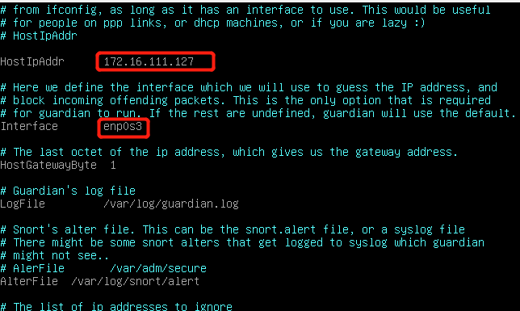

- 开启guardian.pl
  ```
  # 启动 guardian.pl
  perl guardian.pl -c guardian.conf
  ```

  

  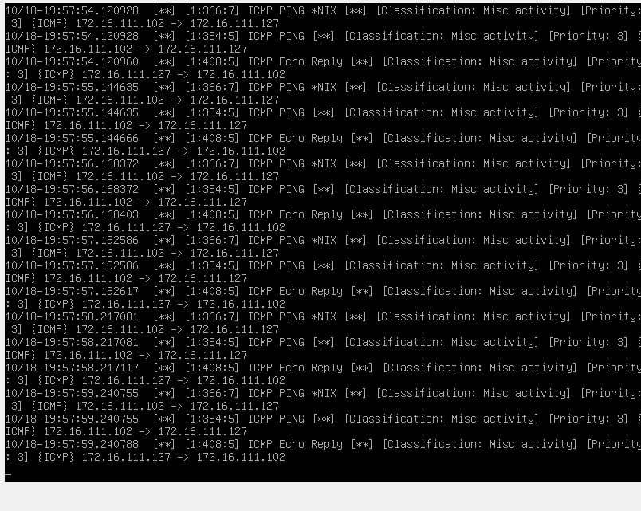

- 在网关中用nmap暴力扫描
  ```
  nmap 172.16.111.127 -A -T4 -n -vv
  ```

  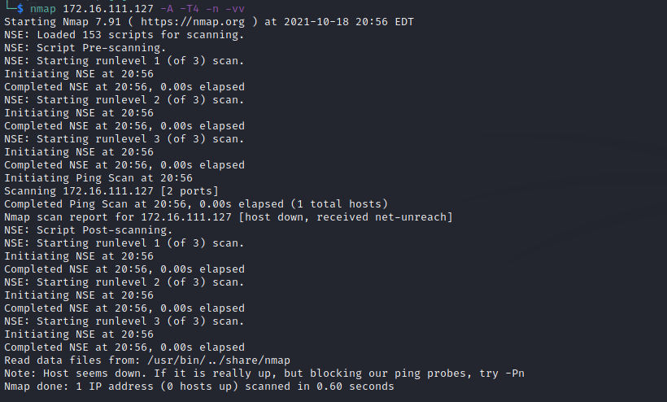

- 查看防火墙规则，guardian.conf 中默认的来源IP被屏蔽时间是 60 秒，在一分钟之后会更新iptable的规则会被删除（屏蔽期间如果黑名单上的来源IP再次触发snort报警消息，则屏蔽时间会继续累加60秒）。
  ```
  root@debian:~/down/guardian# iptables -L -n
  Chain INPUT (policy ACCEPT)
  target     prot opt source               destination
  REJECT     tcp  --  172.16.111.102       0.0.0.0/0            reject-with tcp-reset
  DROP       all  --  172.16.111.102       0.0.0.0/0

  Chain FORWARD (policy ACCEPT) 
  target     prot opt source               destination

  Chain OUTPUT (policy ACCEPT)
  target     prot opt source               destination

  # 1分钟后，guardian.pl 会删除刚才添加的2条 iptables 规则
  root@debian:~/down/guardian# iptables -L -n
  Chain INPUT (policy ACCEPT)
  target     prot opt source               destination

  Chain FORWARD (policy ACCEPT)
  target     prot opt source               destination

  Chain OUTPUT (policy ACCEPT)
  target     prot opt source               destination
  ```

  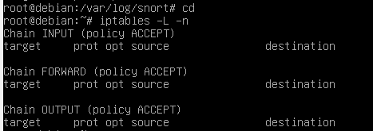

- 由上可知，在攻击者暴力扫描过程中，靶机上的 iptables 添加了拒绝和丢弃的规则，一段时间后，新添加的规则会被删除。

## 参考资料
- [ 实验指导 ](https://c4pr1c3.gitee.io/cuc-ns/chap0x05/main.html)

- [ 往届学长chococolate作业 ](https://github.com/CUCCS/2020-ns-public-chococolate/blob/chap0x09/chap0x09/chap0x09.md)

- [ Snort简介 ](https://blog.csdn.net/cookieXSS/article/details/106529112)